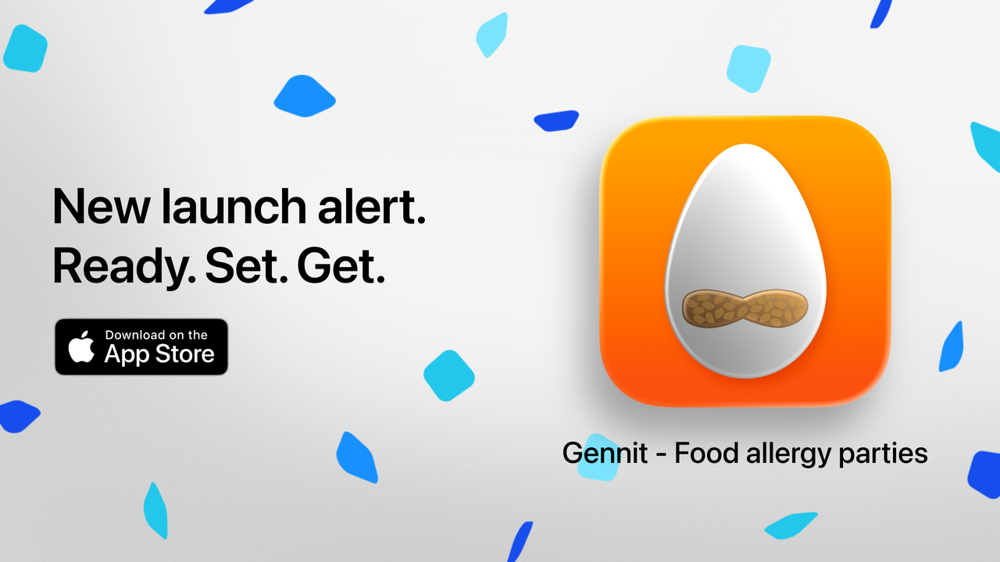
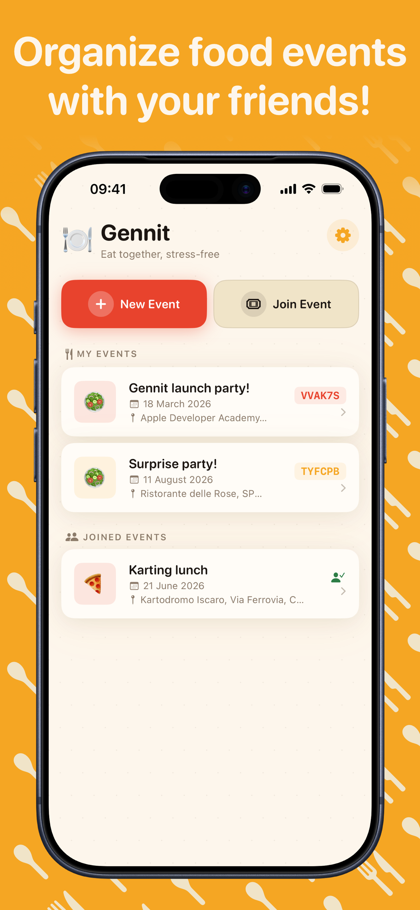
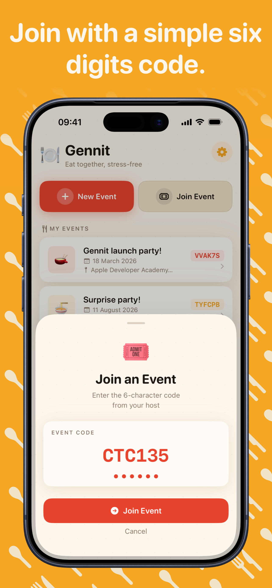
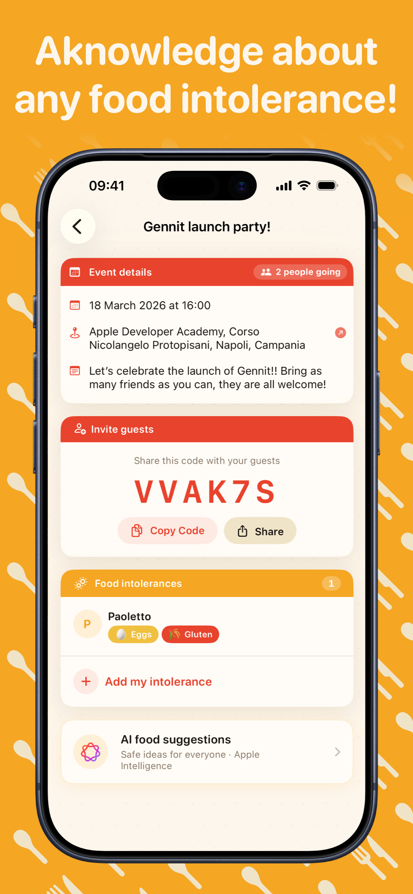

# 🍽️ Gennit — Safe food parties for everyone

  

  
   
  <strong>Gennit</strong> is an iOS application designed to take the stress out of organizing group meals, parties, and events.

---

## 🌟 Overview

Planning a dinner but worried about who's allergic to what? **Gennit** bridges the communication gap between hosts and guests. 

- **Hosts** create an event and share a simple code.
- **Guests** join the event and privately log their intolerances.
- **Everyone** eats safely.

---

## ✨ Key Features

- **📍 Simple Event Management**: Create events with a name, date, and location in seconds.
- **🔗 Seamless Joining**: Guests can join via a unique 6-digit code or a direct "smart link".
- **🛡️ Real-time Notifications**: Hosts receive push notifications the moment a guest adds an intolerance.
- **🤖 AI-Powered Suggestions (Premium)**: Get intelligent meal suggestions and ingredient analysis.
- **🗺️ Navigation Integration**: One-tap directions to event locations.
- **☁️ CloudKit Sync**: Securely sync your events across all your Apple devices.
- **🌓 Adaptive Design**: Full support for Dark Mode with high readability.

---

## 📸 Screenshots

  
  
  

---

## 🛠️ How it Works

1. **Create**: The host starts a "New Event" and gets a unique 6-character access code.
2. **Share**: Share the code or a deep link via iMessage, WhatsApp, or any other platform.
3. **Log**: Guests enter the code and select from common allergens or type their own.
4. **Plan**: The host sees a consolidated list of all dietary requirements.

---

## 💻 Technology Stack

- **Language**: Swift 6.0+
- **Framework**: SwiftUI
- **Persistence & Sync**: Apple CloudKit
- **Deep Linking**: Custom URL Schemes (`gennit://`)
- **Payments**: StoreKit 2 (Subscription-based model)

---

## 🔒 Privacy & Data

Gennit is built with privacy at its core:
- **No Account Required**: Uses your iCloud account via CloudKit; no third-party registrations.
- **Data Ownership**: Users can delete their own events and remove their logged intolerances at any time.

---

## ⚠️ Disclaimer

**AI & Accuracy**: While Gennit uses advanced models to provide food suggestions, AI can make mistakes. Always double-check ingredient labels and consult directly with guests regarding severe allergies.

---

*Note: This repository contains the documentation and project structure for Gennit. The source code is private and maintained by the developer.*
